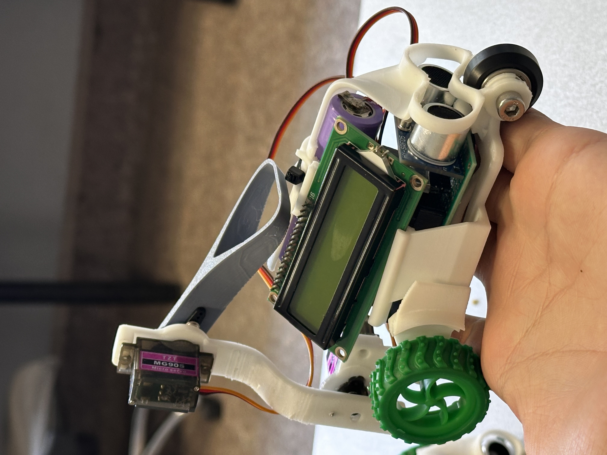
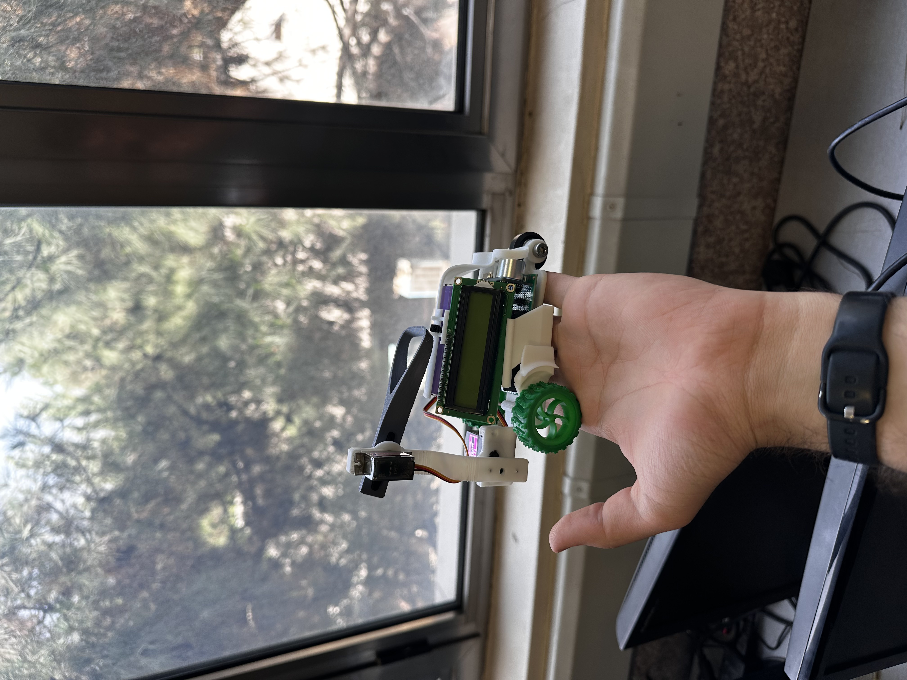

# ربات خزنده هوش مصنوعی 🐛

یک پلتفرم آموزشی ربات خزنده طراحی شده برای دانشجویان هوش مصنوعی. این پروژه تمام چیزهایی که برای طراحی، ساخت و برنامه‌نویسی یک ربات خزنده خودکار نیاز دارید را فراهم می‌کند — از جمله مدل‌های سه‌بعدی، فریمور، قالب‌های منطقی و مستندات کامل.

---

## 📦 محتویات

- `template.ino`: این نقطه شروع برای منطق هوش مصنوعی شماست. آن را تغییر دهید تا رفتار ربات را تعریف کنید.
- مدل‌های سه‌بعدی در Rhino و فرمت‌های خروجی برای مشاهده یا چاپ.
- راهنماهای مونتاژ، استقرار و استفاده.
- نمودارها و تصاویر برای کمک به سیم‌کشی و ساخت.

---

## 🛠️ شروع کار

### 1. کلون کردن مخزن

```bash
git clone https://github.com/amirali-lll/crawling-bot.git
```

### 2. باز کردن و ویرایش قالب منطق

فایل زیر را تغییر دهید:

```bash
templates/template.ino
```

از آن برای تعریف نحوه رفتار ربات استفاده کنید. شما منطق هوش مصنوعی را در اینجا خواهید نوشت.

### 3. آپلود منطق

مراحل موجود در [راهنمای نصب](docs/installation.fa.md) را دنبال کنید تا منطق خود را روی ربات آپلود کنید.

---

## 🧱 ساختار مخزن

| پوشه | محتویات |
|--------|----------|
| `templates/` | فایل منطق `.ino` آغازین برای سفارشی‌سازی |
| `designs/` | طرح‌های سه‌بعدی ربات در Rhino (‎`.3dm`) و فرمت‌های خروجی (‎`.stl`، `.obj`) |
| `docs/` | راهنماهای نوشته شده، نمودارهای سیم‌کشی و دستورالعمل‌های استفاده |

---

## 🖨️ خروجی‌های مدل سه‌بعدی

در پوشه `designs/`:
- `robot-design.3dm` — مدل اصلی Rhino
- `exports/robot.stl`، `robot.obj` — خروجی‌های سه‌بعدی قابل چاپ و مشاهده
- `exploded-view.png` — مرجع بصری برای مونتاژ

---

## 📚 مستندات

### راهنمای ویدیویی
برای مرور کامل ربات و اجزای آن، ویدیو را تماشا کنید:

[▶️ مرور ربات خزنده هوش مصنوعی (Google Drive)](https://drive.google.com/file/d/1TIa0ktaaaPdPyBMpJnHhDxLsFk6jlDfr/view?usp=share_link)

[🚀 مرور ربات خزنده هوش مصنوعی (Telegram)](https://t.me/ai4032_iust/126)


### راهنماهای نوشته شده

- [`docs/installation.fa.md`](docs/installation.fa.md): نصب نرم‌افزار و راه‌اندازی محیط
- [`docs/robot-overview.fa.md`](docs/robot-overview.fa.md): مرور اجزای ربات و مونتاژ


### تصاویر

- `docs/images/`

---

## 📸 پیش‌نمایش




---

## ⚖️ مجوز

این پروژه تحت [مجوز MIT](LICENSE) منتشر شده است. شما آزاد هستید که از این پروژه برای اهداف آموزشی و غیرتجاری استفاده، اصلاح و توزیع کنید.

---

## 🙋‍♀️ برای دانشجویان

دانشجویان باید:
- این مخزن را Fork یا Clone کنند.
- `templates/template.ino` را با منطق خود تغییر دهند.
- آن را با استفاده از راهنماهای ارائه شده روی ربات خزنده مستقر کنند.
- نسخه‌های تغییر یافته این مخزن را ارسال **نکنند** مگر اینکه دستور داده شود.

---

## ❤️ ساخته شده برای آموزش

این ربات و کدهای آن به عنوان بخشی از یک دوره هوش مصنوعی ایجاد شده است تا به دانشجویان کمک کند تا رباتیک در دنیای واقعی، برنامه‌نویسی رفتار هوش مصنوعی و یکپارچه‌سازی سیستم را بیاموزند.

---

## 🌐 نسخه‌های زبان

- [English](README.md)
- [فارسی](README.fa.md)
