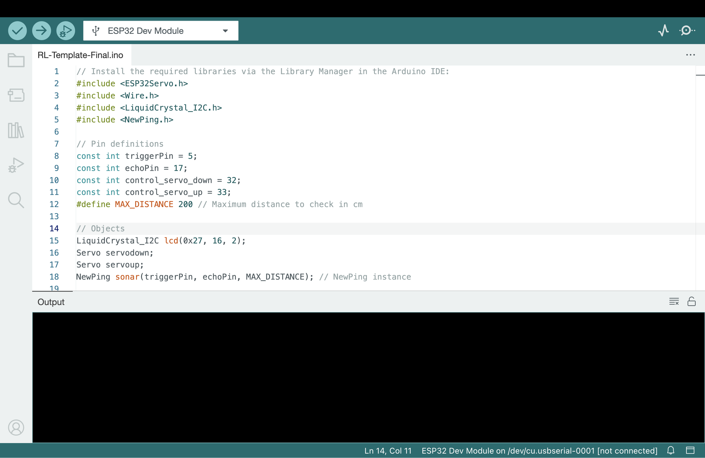
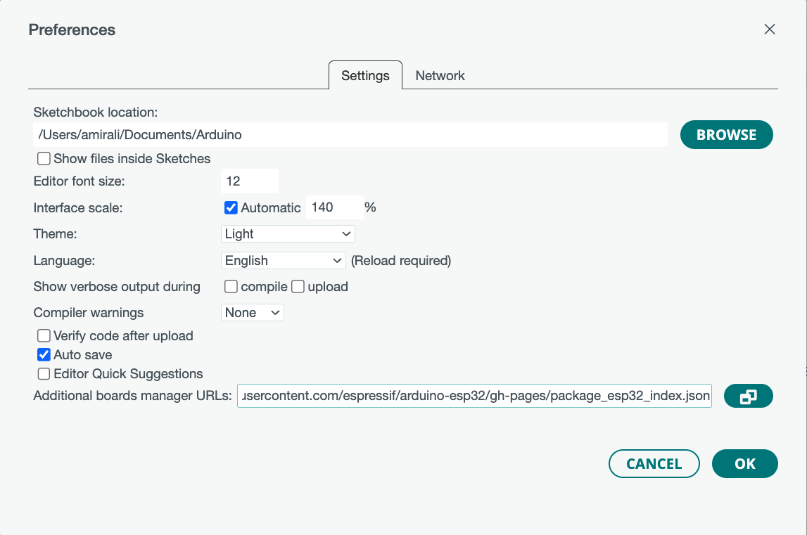
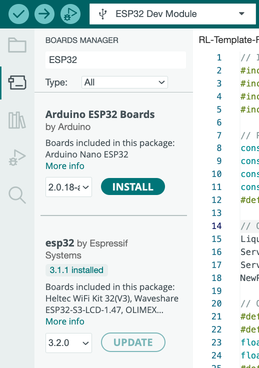
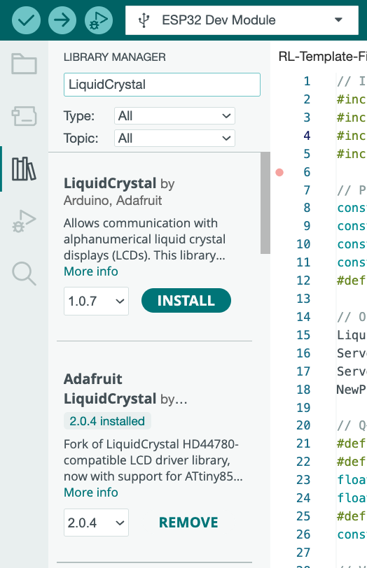
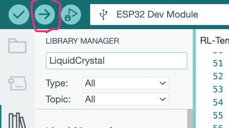
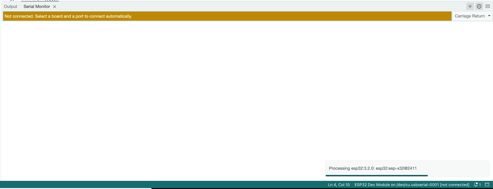

# راهنمای نصب

این راهنما به شما کمک می‌کند نرم‌افزار مورد نیاز را راه‌اندازی کرده و Arduino خود را برای پروژه پیکربندی کنید.

## 🌐 نسخه‌های زبان
- [English](installation.md)
- [فارسی (Persian)](installation.fa.md)

---

## پیش‌نیازها 🛠️

- برد ESP (مانند ESP32، ESP8266)
- کابل USB برای Arduino
- کامپیوتر با دسترسی به اینترنت

## 1. نصب Arduino IDE 💻

1. به [صفحه نرم‌افزار Arduino](https://www.arduino.cc/en/software) بروید.
2. Arduino IDE را برای سیستم عامل خود (Windows، macOS یا Linux) دانلود کنید.
3. IDE را با دنبال کردن دستورالعمل‌های روی صفحه نصب کنید.

   

## 2. پیکربندی Arduino IDE برای بردهای ESP ⚙️

1. Arduino IDE را باز کنید.
2. به **File > Preferences** بروید.
3. در فیلد **Additional Boards Manager URLs**، URL زیر را برای بردهای ESP اضافه کنید:
   ```
   https://dl.espressif.com/dl/package_esp32_index.json
   ```
4. برای ذخیره تنظیمات روی **OK** کلیک کنید.
5. به **Tools > Board > Boards Manager...** بروید.
6. "ESP32" یا "ESP8266" را جستجو کرده و بسته مربوطه را نصب کنید. آن را "ESP32 by Espressif Systems" یا "ESP8266 by ESP8266 Community" نام‌گذاری کنید.


   
    

## 3. اضافه کردن منطق قالب
1. مخزن را روی ماشین محلی خود کلون کنید:
```bash
git clone https://github.com/amirali-lll/crawling-bot.git
```
2. در Arduino IDE یک Sketch جدید ایجاد کنید **File > New Sketch**.
3. محتویات `templates/template.ino` را در sketch جدید خود کپی کنید.
4. sketch را با یک نام معنادار ذخیره کنید.


## 4. نصب کتابخانه‌های مورد نیاز 📚
1. Library Manager را از Arduino IDE انتخاب کنید (در سمت چپ IDE قرار دارد).
2. هر کتابخانه مورد نیاز پروژه خود را جستجو و نصب کنید (هر کتابخانه در `template.ino` ذکر شده است)




## 5. آپلود کد ⬆️
1. برد ESP خود را با استفاده از کابل USB به کامپیوتر خود وصل کنید.
2. در Arduino IDE، به **Tools > Board** بروید و مدل برد ESP خود **ESP32 Dev Module** را انتخاب کنید.
3. به **Tools > Port** بروید و پورت مربوط به برد ESP خود را انتخاب کنید.
4. روی دکمه **Upload** (آیکون فلش راست) کلیک کنید تا کد کامپایل و روی برد ESP خود آپلود شود.

   


## 6. تأیید پیکربندی ✅ (اختیاری)
- **Serial Monitor** (Tools > Serial Monitor) را باز کنید تا خروجی را بررسی کرده و اطمینان حاصل کنید که برد ESP همانطور که انتظار می‌رود کار می‌کند.

