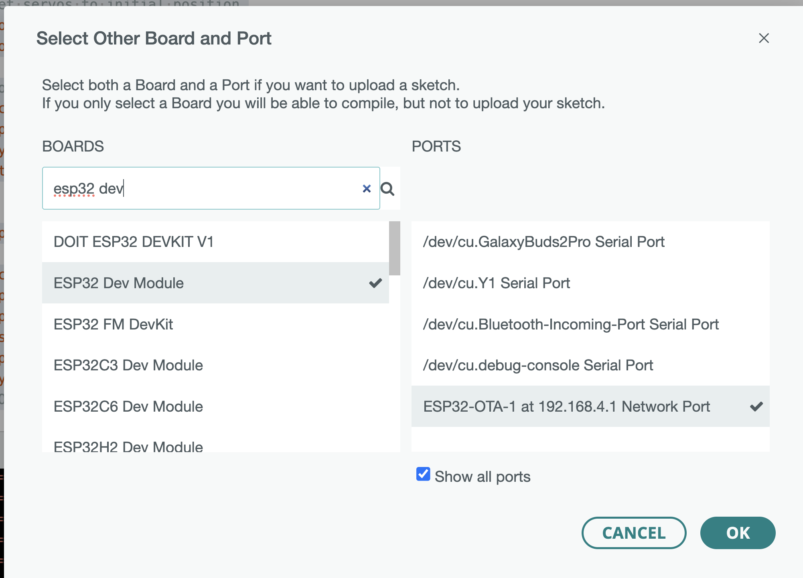
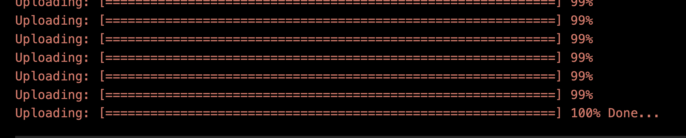

# راهنمای به‌روزرسانی OTA (از راه دور) 🚀

با فعال بودن OTA، می‌توانید کد جدید را به صورت بی‌سیم روی ربات خود آپلود کنید - نیازی به کابل USB نیست! این راهنما شما را گام به گام از این فرآیند عبور می‌دهد.

---

## 🌐 نسخه‌های زبان
- [English](ota.md)
- [فارسی (Persian)](ota.fa.md)

---

## ⚠️ مهم: هرگز پیکربندی OTA را حذف نکنید
OTA (Over-the-Air) برای به‌روزرسانی‌های کد بی‌سیم ضروری است. **کد مربوط به OTA در `template.ino` را حذف یا کامنت نکنید** (شامل `setup_ota()`، `ArduinoOTA` و منطق AP/OTA hostname). حذف این خطوط، آپلود بی‌سیم را غیرفعال می‌کند و به‌روزرسانی‌های آینده را بسیار سخت‌تر می‌کند. همیشه پیکربندی OTA را در فریمور خود برای به‌روزرسانی‌های آسان نگه دارید!

---

## پیش‌نیازها
- ربات شما روشن است و فریمور فعال‌شده با OTA را اجرا می‌کند (به `template.ino` مراجعه کنید).
- ربات نقطه دسترسی WiFi (AP) خود را پخش می‌کند، مثلاً `ESP32-AP-1`. 
- نام نقطه دسترسی WiFi (AP) ربات از قالب `ESP32-AP-<BOT-NUMBER>` پیروی می‌کند (مثلاً `ESP32-AP-3` برای ربات شماره 3).
- کامپیوتر شما WiFi و Arduino IDE نصب شده دارد.

---

## 1. کد خود را آماده کنید
- فایل `.ino` خود را در Arduino IDE باز کنید.
- مطمئن شوید که کد شما بدون خطا کامپایل می‌شود.

---

## 2. به AP WiFi ربات متصل شوید 📶
1. در کامپیوتر خود، تنظیمات WiFi را باز کنید.
2. AP ربات را پیدا کرده و به آن متصل شوید (مثلاً `ESP32-AP-1`).
   - رمز عبور: `12345678`
3. صبر کنید تا کاملاً متصل شوید. ممکن است در حین اتصال به ربات، دسترسی به اینترنت را از دست بدهید.

---

## 3. پورت OTA را در Arduino IDE انتخاب کنید ⚡
1. در Arduino IDE، به **Tools > Port** بروید.
2. یک پورت شبکه به نام `ESP32-OTA-1 at xxx.xxx.xxx.xxx` را جستجو کنید (شماره با شماره ربات شما مطابقت دارد).
3. این پورت شبکه را انتخاب کنید.
> **توجه:** قبل از آپلود، اطمینان حاصل کنید که **Tools > Board** روی **ESP32 Dev Module** در Arduino IDE تنظیم شده است. انتخاب برد صحیح برای آپلود موفق OTA ضروری است.

---

## 4. کد را از طریق OTA آپلود کنید ⬆️
1. روی دکمه **Upload** (آیکون فلش راست) در Arduino IDE کلیک کنید.
    - رمز عبور OTA: `admin`
2. IDE کد شما را کامپایل کرده و به صورت بی‌سیم روی ربات آپلود می‌کند.
3. پیشرفت را در IDE و روی LCD ربات تماشا کنید (پیشرفت و وضعیت OTA را نشان می‌دهد).

---

## 5. موفقیت! 🎉
- هنگامی که آپلود کامل شد، ربات مجدداً راه‌اندازی می‌شود و کد جدید شما را اجرا می‌کند.
- LCD پیام "OTA Update Done" را نمایش می‌دهد و سپس به عملکرد عادی باز می‌گردد.

---

## عیب‌یابی
- **پورت OTA را نمی‌بینید؟**
  - مطمئن شوید که به AP WiFi ربات متصل شده‌اید.
  - پس از اتصال، چند ثانیه صبر کنید تا پورت ظاهر شود.
  - در صورت نیاز Arduino IDE را مجدداً راه‌اندازی کنید.
- **آپلود ناموفق است؟**
  - اطمینان حاصل کنید که فقط یک کامپیوتر به AP ربات متصل است.
  - مطمئن شوید که ربات روشن است و مشغول به‌روزرسانی OTA دیگری نیست.

---

## نکات
- همیشه می‌توانید در صورت نیاز به آپلود USB برگردید.
- برای چندین ربات، هر یک دارای AP و hostname OTA منحصر به فرد خواهند بود (مثلاً `ESP32-AP-2`، `ESP32-OTA-2`).

---

اکنون می‌توانید کد ربات خود را به سرعت و به صورت بی‌سیم به‌روزرسانی کنید!
